# Website Architecture Strategy: AIProfitHub

## 1. SITEMAP
### Globalny Cel
Stworzenie ścieżek konwersji dopasowanych do trzech różnych person (SMB, Fintech, Enterprise) oraz budowanie zaufania w sektorze finansowym.

### Struktura Drzewiasta
```text
Homepage
├── /produkty
│   ├── /entry (Start Smart)
│   │   ├── Cel: Zakup Self-Service (Low Touch)
│   │   ├── Kluczowa sekcja: Feature Grid ("Wszystko co niezbędne")
│   │   └── Primary CTA: "Rozpocznij za darmo"
│   ├── /pro (Growth)
│   │   ├── Cel: Start Trialu / Demo (Mid Touch)
│   │   ├── Kluczowa sekcja: ROI Calculator Preview
│   │   └── Primary CTA: "Rozpocznij 14-dniowy trial"
│   └── /enterprise (Intelligence)
│       ├── Cel: Umówienie rozmowy sprzedażowej (High Touch)
│       ├── Kluczowa sekcja: Security & Compliance Trust Badges
│       └── Primary CTA: "Skontaktuj się z działem sprzedaży"
├── /rozwiazania (Use Cases)
│   ├── /dla-bankow
│   │   ├── Cel: Pozycjonowanie jako bezpieczny partner Enterprise
│   │   ├── Kluczowa sekcja: Client Success Stories (Logo Wall)
│   │   └── Primary CTA: "Pobierz Security Whitepaper"
│   ├── /dla-fintechow
│   │   ├── Cel: Edukacja o redukcji Churnu
│   │   ├── Kluczowa sekcja: API Integration Showcase
│   │   └── Primary CTA: "Zobacz dokumentację API"
│   └── /dla-malych-firm
│       ├── Cel: Szybka edukacja i wdrożenie
│       ├── Kluczowa sekcja: "Jak to działa w 3 krokach"
│       └── Primary CTA: "Sprawdź swoje opinie"
├── /cennik
│   ├── Cel: Porównanie i segmentacja użytkownika
│   ├── Kluczowa sekcja: Tabela porównawcza (Sticky Header)
│   └── Primary CTA: (Zależne od pakietu) - "Wybierz"
├── /kalkulator-roi (Lead Magnet)
│   ├── Cel: Generowanie leadów kwalifikowanych (MQL)
│   ├── Kluczowa sekcja: Interaktywny suwak oszczędności
│   └── Primary CTA: "Wyślij raport na e-mail"
├── /baza-wiedzy
│   ├── /blog
│   └── /faq
├── /o-nas (Team, Trust)
└── /kontakt
```

## 2. USER FLOWS (Ścieżki Użytkownika)

```mermaid
graph TD
    %% A) Bank Decision Maker (Enterprise)
    subgraph "A) Bank Decision Maker (Enterprise)"
        A1[Start: LinkedIn Ad / Organic Search] --> A2(Homepage)
        A2 --> A3(Rozwiązania: Dla Banków)
        A3 --> A4{Zainteresowany?}
        A4 -- Tak --> A5[Case Study / Social Proof]
        A5 --> A6(Formularz Kontaktowy Enterprise)
        A6 --> A7[CRM: Sales Pipeline]
    end

    %% B) Fintech Founder (Pro)
    subgraph "B) Fintech Founder (Pro)"
        B1[Start: Blog Post o Churnie] --> B2(Artykuł)
        B2 --> B3[Link: Policz ile tracisz]
        B3 --> B4(Kalkulator ROI)
        B4 --> B5(Wynik: Potencjalne oszczędności)
        B5 --> B6(Cennik / Pakiety)
        B6 --> B7[CTA: Start Trial / Demo]
    end

    %% C) Small Business Owner (Entry)
    subgraph "C) Small Business Owner (Entry)"
        C1[Start: Google Search 'analiza opinii'] --> C2(Landing Page: Entry)
        C2 --> C3{Przekonany?}
        C3 -- Nie --> C4(Zobacz Demo / Screeny)
        C3 -- Tak --> C5(Cennik sekcja Entry)
        C5 --> C6[Rejestracja Self-Service]
        C6 --> C7[Onboarding Automatyczny]
    end
```



## 3. NAVIGATION STRATEGY

### Main Menu (Desktop)
*Układ poziomy, od lewej:*
1.  **Logo**
2.  **Produkty** (Dropdown/Mega Menu)
    *   Start Smart (Entry)
    *   Growth (Pro)
    *   Intelligence (Enterprise)
3.  **Rozwiązania** (Dropdown)
    *   Dla Banków
    *   Dla Fintechów
    *   Dla Małych Firm
4.  **Cennik** (Bezpośredni link)
5.  **Baza Wiedzy** (Dropdown: Blog, FAQ, Kalkulator)
6.  *Right Side:*
    *   **Zaloguj** (Ghost Button / Link)
    *   **Rozpocznij** / **Demo** (Solid Primary Button)

### Mobile Menu (Hamburger)
1.  **Produkty** (Rozwijane akordeonem)
2.  **Cennik** (Priorytet)
3.  **Rozwiązania**
4.  **Zaloguj się**
5.  **CTA: Rozpocznij za darmo** (Sticky na dole menu lub wyróżnione tło)

### Footer
*   **Product**: Features, Pricing, API, Integrations, Changelog
*   **Solutions**: Banks, Fintech, SMB, ROI Calculator
*   **Company**: About Us, Careers, Contact, Legal (Privacy, Terms)
*   **Resources**: Blog, Help Center, Community
*   **Social & Trust**: LinkedIn icon, ISO Certification, GDPR Compliant badge

## 4. CONVERSION OPTIMIZATION (CRO) Strategy

### Sticky Bar
*   **Placement**: Góra strony (Top of viewport), zamykany.
*   **Komunikat**: "Tracisz klientów przez złe opinie? Sprawdź nasz raport roczny." lub "Promocja: -20% na plan Pro do końca miesiąca."
*   **CTA**: "Sprawdź teraz →"

### Exit Intent Popup
*   **Trigger**: Kursor myszy wyjeżdża poza viewport (desktop) lub szybkie scrollowanie do góry (mobile - trudniejsze, częściej time-based).
*   **Kontekst: Cennik**
    *   **Headline**: "Nie jesteś pewien, który plan wybrać?"
    *   **Offer**: "Pobierz porównanie pakietów w PDF i skonsultuj z zespołem."
    *   **CTA**: "Pobierz PDF" (Lead Gen - pobiera email)
*   **Kontekst: Blog**
    *   **Headline**: "Chcesz więcej takich treści?"
    *   **Offer**: "Zapisz się na newsletter o AI w finansach."

### Lead Magnets & Progressive Profiling
1.  **Kalkulator ROI**:
    *   **Lokalizacja**: Dedykowana podstrona + widgety na blogu i stronie głównej.
    *   **Dane (Step 1)**: Przychód roczny, Ilość klientów (Suwaki - anonimowe).
    *   **Dane (Step 2)**: Wynik częściowy.
    *   **Dane (Step 3)**: "Wyślij pełny raport" -> Wymaga Email (To jest moment konwersji).
2.  **Raport Churn 2024 (E-book/Whitepaper)**:
    *   **Lokalizacja**: Stopka artykułów blogowych, Exit Intent na stronie Solutions.
    *   **Progressive Profiling**: Jeśli mamy już email użytkownika (z cookie), pytamy o: Numer telefonu lub Stanowisko.
